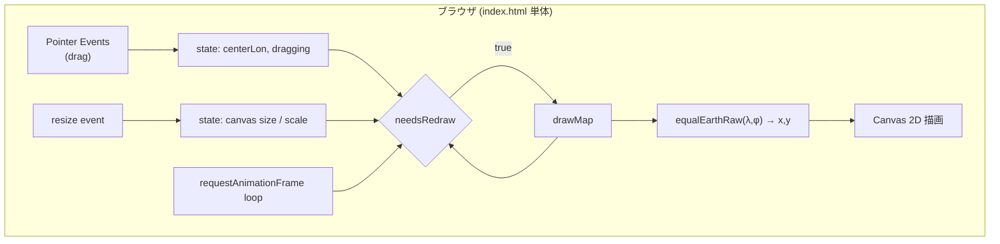

# 設計書: Equal Earth Projection Map

## 1. 概要

`要件.txt` に基づき、Equal Earth Projection（イコールアース図法）による世界地図を Canvas に描画し、マウスドラッグで中心経度を連続的に変更できる単一HTMLファイルのブラウザアプリを実装する。

## 2. 全体アーキテクチャ



- イベントハンドラ（ドラッグ・リサイズ）は状態（`centerLonDeg` 等）を更新するだけで、直接描画は行わない。
- 描画は `requestAnimationFrame` の `tick()` ループが `needsRedraw` フラグを見て、必要なときだけ `drawMap()` を呼ぶ。これにより描画とイベント処理を分離し、カクつきのないスムーズな更新を実現する。

## 3. モジュール構成

`index.html` 内で以下のように論理的にモジュール分割している（言語がブラウザJSのため物理ファイル分割はせず、単一ファイル内でセクションコメントにより分離）。

| モジュール | 責務 | 主な関数 |
|---|---|---|
| Projection | 経度緯度→投影座標の純粋計算 | `toRadians`, `toDegrees`, `normalizeLongitude`, `equalEarthRaw`, `project`, `dragDeltaToLongitudeDelta` |
| Data | 簡易世界地図データ | `WORLD_LAND` |
| Render | Canvas描画・リサイズ | `resizeCanvas`, `drawMap` |
| Interaction | ポインタ操作のハンドリング | `pointerdown`/`pointermove`/`pointerup`/`pointercancel` ハンドラ, `endDrag` |
| Main loop | 描画スケジューリング | `tick` |

コアロジック（Projectionモジュールの6関数）は `src/equalEarth.js` にも同一実装として切り出し、Vitestによるユニットテスト対象としている。単一ファイル配布という `要件.txt` の制約と、テスト容易性を両立するためのトレードオフである（詳細は 6章 参照）。

## 4. データ構造

```js
state = {
  centerLonDeg: number,   // 現在の中心経度（度）。初期値 0
  scale: number,          // 投影座標→ピクセルのスケール係数
  isDragging: boolean,
  lastPointerX: number,
  needsRedraw: boolean,
}

WORLD_LAND: Array<Array<[lonDeg: number, latDeg: number]>>
// 各要素が1つの陸地ポリゴン（頂点の [経度,緯度] 配列）
```

## 5. Equal Earth Projection の投影式

d3-geo-projection が採用する公知の Equal Earth Projection 定式化（Šavrič, Patterson, Jenny, 2018）と同一の定数・数式を自前実装している。

```
A1 = 1.340264, A2 = -0.081106, A3 = 0.000893, A4 = 0.003796, M = sqrt(3)/2

θ = asin(M · sin(φ))
x = λ · cos(θ) / (M · (A1 + 3·A2·θ² + θ⁶·(7·A3 + 9·A4·θ²)))
y = θ · (A1 + A2·θ² + θ⁶·(A3 + A4·θ²))
```

- `λ`（ラムダ）, `φ`（ファイ）はラジアン。`λ` には「経度 − 中心経度」を正規化した差分を渡す。
- 投影空間の座標をピクセルへ変換: `x_pixel = cx + scale·x`, `y_pixel = cy − scale·y`（Canvasは下方向が正のためyを反転）。
- `scale` は `resizeCanvas()` で、投影のx最大値（λ=180°での値 ≈2.7066）・y最大値（極点での値 ≈1.3174）とキャンバスサイズから、余白込みで算出する。

## 6. ドラッグ操作の設計

- 赤道上でのX方向スケール `pxPerRadianAtEquator = scale / (M·A1)` を基準に、ピクセル移動量を経度変化量に変換する（`dragDeltaToLongitudeDelta`）。
- ポインタイベント（`pointerdown` / `pointermove` / `pointerup` / `pointercancel`）を用い、`setPointerCapture` でドラッグ中にポインタがキャンバス外に出ても操作を継続できるようにしている。
- イベントハンドラは `state.centerLonDeg` の更新と `needsRedraw = true` の設定のみを行い、実描画は行わない（5章のアーキテクチャ図の通り）。

## 7. ダテライン（対蹠経線）分割の設計

**課題**: `WORLD_LAND` の元データ自体は経度±180°をまたがないように作成しているが、ユーザーがドラッグして中心経度を変えると、現在の中心の対蹠側（中心経度+180°）がポリゴンの頂点間を通過することがある。この場合、`project()` が返す相対経度が頂点ごとに +180°⇔−180° の境界をまたいで不連続にジャンプし、ポリゴンの端から端まで直線で結ばれてしまう（帯状に伸びる描画崩れ）。

**対策**: `drawMap()` でポリゴンの各頂点を描画する際、直前の頂点との相対経度差の絶対値が180°を超える場合は `lineTo` ではなく `moveTo` で新しいサブパスを開始する。これにより、対蹠経線をまたぐ箇所でポリゴンが分割され、帯状のノイズが解消される。簡易化されたポリゴンデータであるため、分割後の各断片をそのまま塗りつぶすだけで実用上十分な見た目になることを、実機（ヘッドレスChromium）での目視確認で検証済み。

## 8. エラーハンドリング方針

- `canvas.getContext('2d')` が `null` の場合、キャンバスを非表示にし、代替テキスト（`#fallback`）を表示する。`console.error` で1回だけログを出す。
- リサイズ時の幅・高さは `Math.max(1, ...)` で最小値1にクランプし、0除算やゼロサイズ描画を防ぐ。
- 投影結果が `Number.isFinite` でない（NaN/Infinity）場合は、その頂点をスキップして `console.warn` を出す。想定される発生条件はない（テストで境界値を検証済み）が、防御的に実装している。

## 9. ロギング方針

- 通常動作時はコンソール出力を行わない。
- 初期化失敗（Canvas未対応）時のみ `console.error`、描画時の異常値検出時のみ `console.warn` を出す。

## 10. テスト方針

- フレームワーク: Vitest（`npm test` で実行）。
- 対象: `src/equalEarth.js` の6つの純粋関数（`toRadians`, `toDegrees`, `normalizeLongitude`, `equalEarthRaw`, `project`, `dragDeltaToLongitudeDelta`）。
- 網羅する性質:
  - `equalEarthRaw(0,0) ≈ [0,0]`
  - 経度・緯度それぞれの反転対称性
  - 赤道上経度180°での解析的に導出できる最大x値
  - 極点での最大y値（南北対称）
  - `normalizeLongitude` の境界値（0, ±180, ±190, 360, 720+α, -540 等）
  - `project` の中心一致時の恒等性、および経度と中心経度の同時シフトに対する回転不変性
  - `dragDeltaToLongitudeDelta` の符号の一貫性・scaleに対する反比例性
- ブラウザ実行時の描画・ドラッグ操作については、ヘッドレスChromium（Playwright）を用いて手動で動作確認を行った（初期表示・ドラッグによる再投影・対蹠経線分割・ウィンドウリサイズの4点）。この確認作業は開発時の検証のみに用い、成果物のリポジトリには含めていない。

## 11. 設計レビュー記録

plan フェーズで実施した第三者視点レビューの結果は以下の通り。High/Medium指摘は本設計・実装に反映済み。

| # | 重大度 | 指摘 | 対応 |
|---|--------|------|------|
| 1 | High | ダテラインをまたぐポリゴンによる描画破綻の懸念 | 実装時に「中心経度の対蹠側をまたぐ場合」にも同様の問題が発生することを実機確認で発見し、7章の対蹠経線分割ロジックで解消 |
| 2 | Medium | `src/equalEarth.js` と `index.html` 内コードの二重管理リスク | 単一ファイル要件とテスト容易性の両立のためのトレードオフとして許容し、両者を同一実装に保つ運用とした |
| 3 | Medium | ドラッグ処理と描画の同期によるカクつきの懸念 | イベントハンドラは状態更新のみを行い、描画は rAF ループでのみ実行する設計とした |
| 4 | Low | 高DPI環境でのぼやけ | `resizeCanvas` で `devicePixelRatio` を考慮 |
| 5 | Low | 極付近の歪み・ドラッグ速度の不自然さ | 擬円筒図法の一般的な制約であり、要件範囲外として許容 |

## 12. ファイル構成

```
23_EqualEarth/
├── index.html              # 要件.txtが求める単一ファイル成果物（提出物の本体）
├── src/equalEarth.js        # コアロジックのテスト用ソース（index.htmlと同一実装を保持）
├── test/equalEarth.test.js  # Vitest ユニットテスト
├── package.json             # devDependency: vitest, "test"スクリプト
├── docs/設計書.md            # 本設計書
├── README.md                 # 概要/依存/起動/使用方法/ライセンス等
└── LICENSE                   # Apache License 2.0
```
