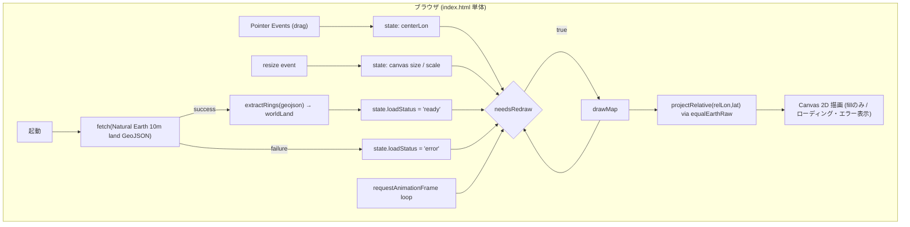

# 設計書: Equal Earth Projection Map

## 1. 概要

`要件_修正版.txt` に基づき、Equal Earth Projection（イコールアース図法）による世界地図を Canvas に描画し、マウスドラッグで中心経度を連続的に変更できる単一HTMLファイルのブラウザアプリを実装する。地図データは Natural Earth 10m land（CC0）の GeoJSON を `fetch()` で取得し、その全座標を自前実装の投影関数で変換して描画する。

## 2. 全体アーキテクチャ



- イベントハンドラ（ドラッグ・リサイズ）は状態を更新するだけで、直接描画は行わない。
- 描画は `requestAnimationFrame` の `tick()` ループが `needsRedraw` フラグを見て、必要なときだけ `drawMap()` を呼ぶ。

## 3. モジュール構成

| モジュール | 責務 | 主な関数 |
|---|---|---|
| Projection | 経度緯度→投影座標の純粋計算 | `toRadians`, `toDegrees`, `normalizeLongitude`, `equalEarthRaw`, `projectRelative`, `project`, `unwrapRingLongitudes`, `ringLongitudeRange`, `longitudeShiftsForView`, `dragDeltaToLongitudeDelta` |
| Data | Natural Earth GeoJSON の取得・整形 | `extractRings`, `loadWorldLand` |
| Render | Canvas描画・リサイズ・ローディング/エラー表示 | `resizeCanvas`, `drawMap`, `drawLand`, `drawMessage` |
| Interaction | ポインタ操作のハンドリング | `pointerdown`/`pointermove`/`pointerup`/`pointercancel` ハンドラ, `endDrag` |
| Main loop | 描画スケジューリング | `tick` |

コアロジック（Projection の主要関数、および Data モジュールの `extractRings`）は `src/equalEarth.js` / `src/geojson.js` にも同一実装として切り出し、Vitestによるユニットテスト対象としている。単一ファイル配布という要件の制約と、テスト容易性を両立するためのトレードオフである。

## 4. データ構造

```js
state = {
  centerLonDeg: number,   // 現在の中心経度（度）。初期値 0
  scale: number,          // 投影座標→ピクセルのスケール係数
  isDragging: boolean,
  lastPointerX: number,
  needsRedraw: boolean,
  worldLand: Array<{ unwrapped: Array<[lonDeg, latDeg]>, range: [number, number] }> | null,
  // fetch完了後にセットされる、リングごとの前処理済みデータ（8章参照）
  loadStatus: 'loading' | 'ready' | 'error',
  loadError: string | null,
}
```

## 5. 地図データの取得（fetch）

- 取得元: `https://raw.githubusercontent.com/martynafford/natural-earth-geojson/master/10m/physical/ne_10m_land.json`
  （Natural Earth 10m land、CC0ライセンス、`martynafford/natural-earth-geojson` リポジトリ）
- **要件記載のURLからの補正について**: `要件_修正版.txt` に記載された `10m/land.geojson` というパスは実在しない（404）。同リポジトリの実際のディレクトリ構成を調査し、同じ内容（Natural Earth 10m land・CC0・同一リポジトリ）を持つ正しいパス `10m/physical/ne_10m_land.json` に補正して実装している。
- `loadWorldLand()` が起動時に一度だけ `fetch()` を行い、`extractRings()` で GeoJSON の `Polygon`/`MultiPolygon` geometry から全リング（外環・内環）を `[経度,緯度]` の配列に平坦化して `state.worldLand` に格納する。
- 実データは約18.3MB、リング数4065、総座標点数は約41万点（2026年時点のデータ）。

## 6. Equal Earth Projection の投影式

d3-geo-projection が採用する公知の Equal Earth Projection 定式化（Šavrič, Patterson, Jenny, 2018）と同一の定数・数式を自前実装している（変更なし）。

```
A1 = 1.340264, A2 = -0.081106, A3 = 0.000893, A4 = 0.003796, M = sqrt(3)/2

θ = asin(M · sin(φ))
x = λ · cos(θ) / (M · (A1 + 3·A2·θ² + θ⁶·(7·A3 + 9·A4·θ²)))
y = θ · (A1 + A2·θ² + θ⁶·(A3 + A4·θ²))
```

- `λ`（ラムダ）, `φ`（ファイ）はラジアン。
- `x_pixel = cx + scale·x`, `y_pixel = cy − scale·y`（Canvasは下方向が正のためyを反転）。
- `scale` は、投影のx最大値（λ=180°での値 ≈2.7066）・y最大値（極点での値 ≈1.3174）とキャンバスサイズから、余白込みで算出する。

## 7. ドラッグ操作の設計（変更なし）

- 赤道上でのX方向スケール `pxPerRadianAtEquator = scale / (M·A1)` を基準に、ピクセル移動量を経度変化量に変換する（`dragDeltaToLongitudeDelta`）。
- `pointerdown`/`pointermove`/`pointerup`/`pointercancel` と `setPointerCapture` を用いる。
- イベントハンドラは `state.centerLonDeg` の更新と `needsRedraw = true` の設定のみを行い、実描画は `tick()` に任せる。

## 8. 経度ラップアラウンドの処理（3度の再設計を経て、事前計算＋複製描画方式に確定）

対蹠経線（経度±180°）付近の描画は、本アプリで最も試行錯誤した部分である。過去2つの設計（8.1〜8.2に要約）はいずれも「境界をまたぐ箇所でパスを分割・接続する」という発想に基づいていたが、いずれも別の不具合を生んだ。最終的に、**分割・接続という発想そのものをやめ、リングを中心経度に依存しない連続した形で1回だけ前処理し、必要な360°オフセット分だけ複製して描画し、表示範囲外はCanvas自身の自然なクリップに委ねる**方式（8.3）に落ち着いた。

### 8.1 過去の設計（要約）

- **第1版（moveToによる単純分割）**: 対蹠経線をまたぐ頂点間で `moveTo` により新しいサブパスを開始する方式。Canvasが未閉合のサブパスを直線で自動的に閉じる仕様と衝突し、高精細な実データで地図全体を横切る帯状の破綻が生じた。
- **第2版（中心経度依存の連続アンラップ方式）**: リングの最初の頂点を中心経度基準で正規化してから連続アンラップする方式。正規化の不連続性（境界±180°）により、ドラッグでわずかに中心経度が変わるだけで大陸全体が反対側の端へ「テレポート」して見える不具合が発生した。
- **第3版（境界での分割＋境界通過点の挿入、曲線補間つき）**: 対蹠経線をまたぐ辺を検出し、境界通過点を線形補間して挿入・分割し、さらに境界上の閉じ方を曲線補間する方式。前述2つの不具合は解消したが、**分割位置の判定に用いる「隣接頂点の経度差が180°を超えたら交差とみなす」というロジックが、1リングに複数回（実データでは最大18回）の交差があるケースで、始点・終点の境界の符号が一致しない断片を生むことがあり**、その場合に直線で閉じる際に地図を横切る誤った塗りつぶしが発生した（ユーザー報告: 「ちょっと動かしただけで地中海が現れたり消えたりする」。原因は地中海自体ではなく、それを含む巨大な陸塊リング―ユーラシア+南北アメリカを含む81,532頂点のリング―の対蹠経線処理が中心経度によって不安定になっていたこと）。

これら3回の設計はいずれも「対蹠経線を検出し、その場でパスを操作する」という同じ発想の派生であり、根本的に脆さを抱えていた。そこで発想を変え、**分割・接続を一切行わない**方式に設計し直した。

### 8.2 最終設計の考え方

Equal Earth Projection の投影後 x 座標は、経度 λ（ラジアン）に対して**線形**である（`x = λ・cos(θ)/(...)`、係数は緯度のみに依存）。したがって、ある点の経度を 360°（＝2πラジアン）だけずらして投影した場合、x 座標はちょうど「1つの地図の全幅」だけシフトする。この性質を利用し、次の3ステップで描画する。

1. **リングごとに、中心経度に依存しない「連続経度表現」を1回だけ前処理する**（データ読み込み時、`unwrapRingLongitudes`）。各頂点の経度を、直前の頂点に最も近い360°の整数倍の分岐へ補正していくことで、対蹠経線をまたいでも隣接頂点間の経度差が小さいまま連続する表現を得る。実データは10m解像度で隣接頂点の間隔が最大でも約0.5°しかないため、この「直前の頂点に最も近い分岐」という判定は常に一意かつ安定に定まる。
2. **リングごとに、この連続経度の最小・最大値（範囲）も1回だけ前処理する**（`ringLongitudeRange`）。
3. **毎フレーム、リングごとに「表示に必要な360°オフセット」を求め（`longitudeShiftsForView`）、そのオフセット分だけリング全体をそのまま複製描画する。** オフセットは、リングの範囲が現在の表示範囲 `[中心経度-180°, 中心経度+180°]` と重なるものだけを選ぶ。通常は1個（リングが表示範囲の一方の端にしか関係しない場合）だが、リングが表示範囲の両端にまたがる場合は2個以上になることもある。表示範囲からはみ出す部分は、Canvas自身の矩形クリップにより自然に描画されない。

```
// 前処理（データ読み込み時に1回だけ）
unwrapped = unwrapRingLongitudes(ring)         // 中心経度に依存しない連続経度
range     = ringLongitudeRange(unwrapped)      // [最小経度, 最大経度]

// 毎フレーム（リングごと）
shifts = longitudeShiftsForView(range, 中心経度) // 必要な360°オフセットの候補一覧
for shift in shifts:
    shifted = unwrapped の各点を (経度+shift-中心経度, 緯度) にしたもの
    clipped = clipRingToLongitudeWindow(shifted)  // 8.3章参照。relLon∈[-180,180]へ明示的にクリップ
    clipped を1本の連続したパスとして投影・描画する
```

当初は「表示範囲外はCanvas自身が自然にクリップするので、投影後の座標をそのままCanvasに渡せばよい」と考えていたが、これは誤りだった（8.3章）。実際には、投影前の段階でパラメータ空間（経度・緯度）上で明示的にクリップする必要がある。

副次的な効果として、経度の連続化（従来は毎フレーム約41万点に対して実行していた）が読み込み時の1回だけで済むようになり、毎フレームの処理は「リングごとの360°オフセット候補の判定＋クリップ＋該当分の投影」のみとなった。

### 8.3 「Canvas任せの自然なクリップ」が成り立たなかった問題（重要）

8.2の設計を実装した直後は、「表示範囲外はCanvas自身の矩形クリップに任せればよい」と考え、投影後の座標をそのままCanvasに渡していた（明示的なクリップ処理を行っていなかった）。ところがユーザー検証で、**地図の端のほうで「大陸テレポート」のような不具合（本来表示されないはずの場所に大きな陸地の断片が現れたり消えたりする）が再発する**ことが判明した。

原因を実データで調査した結果、次のことが分かった。Equal Earth Projection の投影後 x 座標は `x = relLon・cos(θ)/(...)` であり、relLon（経度）に対しては線形だが、**その係数 `cos(θ)/(...)` は緯度によって変化し、高緯度になるほど小さくなる**（例: 赤道での係数 ≈0.86 に対し、緯度78°付近では ≈0.51）。このため、relLon が ±180° を大きく超えていても（実データでは relLon ≈300°、緯度78°付近の点で確認）、係数が小さい分だけ x 座標が縮小され、**キャンバスの表示範囲内（特に、地図の余白として確保していたマージン部分）に収まってしまう**ケースがあった。

「表示範囲外はCanvasが自然にクリップする」という前提は、x座標が緯度によらず一定の閾値を超えれば必ずキャンバス外になる場合にのみ成り立つが、Equal Earth Projection ではこの前提が緯度によって崩れる。その結果、対蹠経線の反対側にある陸地の一部が、本来表示されるべきでない中心経度で、境界付近にゴースト状に出現・消失していた（ユーザー報告の「大陸テレポート」「表示領域からはみ出す」はこの現象を指す）。

**対策**: 投影する前に、パラメータ空間（経度・緯度平面）上で `clipRingToLongitudeWindow` により relLon を明示的に `[-180, 180]` へクリップする（Sutherland-Hodgman法による2本の半平面クリップ）。境界と交差する辺には線形補間した交点を挿入し、境界上で緯度差の大きい閉じ辺は8.1第3版と同様に緯度約2°刻みで細分化して、地図本来の輪郭曲線に沿うようにしている。これにより、`relLon` が表示可能範囲を超える点が投影されることは一切なくなり、緯度に依存した「Canvas任せのクリップの破綻」が根本的に解消される。

実機検証では、不具合が実際に発生していた中心経度（162.7°→162.4°の間でリング内の21,041頂点—約4分の1—が誤って表示範囲内に投影されていたことを確認）で修正前後を比較し、修正後は問題の頂点群が正しく除去されることを確認した。また、1px刻みで2周分（1440px）連続ドラッグしながら陸地面積（緑ピクセル数）の推移を監視したところ、修正前は最大445ピクセルの急激な変化が見られたのに対し、修正後は最大50ピクセルまで低下し、大きな不連続は解消された。

### 8.4 既知の限定事項（Antarctica）

Natural Earth land データのAntarctica（南極大陸）は、経度を一周（360°）してから閉じる単一の環（約1.6万頂点）として表現されている。`unwrapRingLongitudes` でこのリングを連続化すると、始点と終点の経度が理論上360°分ずれる（一周した分）。`clipRingToLongitudeWindow` によるクリップは各シフト候補ごとに正しく機能するが、この環がちょうど極を取り囲むという特殊な位置関係のため、縫い目付近にごく軽微な描画上の不整合が理論上残り得る。実機検証では、複数の中心経度（この環の縫い目の絶対経度 -57° 付近を含む）で目視確認したが、視認できる不整合は確認されなかった。既知の限定事項として記録し、将来的に気になる場合は極を横断する場合の特別処理を含む完全な球面ポリゴンクリッピング（例: d3.geoClipAntimeridian 相当のアルゴリズム）の実装を検討する。

## 9. 描画パフォーマンス

- 約41万点のNode.js上でのEqual Earth投影計算ベンチマークでは、1回のフルパス処理が約0.2〜1ms（JITウォームアップ後）と非常に高速であり、投影計算自体はボトルネックにならない。
- ボトルネックはCanvasへの大量パス構築・描画であるため、**ストローク（輪郭線）を行わずfillのみ**とすることで負荷を抑えている。
- 経度の連続化（`unwrapRingLongitudes`）はデータ読み込み時に1回だけ行い、毎フレームは行わない（8.2章）。毎フレームの処理はリングごとの360°オフセット候補判定（`longitudeShiftsForView`）、`clipRingToLongitudeWindow` によるクリップ、該当分の投影のみ。
- ヘッドレスChromiumでの実測（1200×700ビューポート、連続ドラッグ中）: 平均フレーム間隔 約28ms（平均約36fps）、最大フレーム間隔 約50ms。明示的クリップ（8.3章）を追加した後も同程度の性能を維持している。60fpsに満たない場面はあるが、操作不能になるような致命的なカクつきはなく、要件の「requestAnimationFrameを使ってスムーズに描画する」を実用上満たすと判断した。より高いフレームレートが必要な場合は、ドラッグ中のみ頂点を間引く簡易LOD（Level of Detail）の追加を検討できる（本バージョンでは未実装）。

## 10. エラーハンドリング方針

- `canvas.getContext('2d')` が `null` の場合、キャンバスを非表示にし、代替テキスト（`#fallback`）を表示する。
- `fetch()` の失敗（ネットワークエラー、HTTPステータス非2xx、JSON構文エラー）を `try/catch` で捕捉し、`state.loadStatus='error'` として画面にエラーメッセージを表示する。`console.error` で詳細を出す。
- リサイズ時の幅・高さは `Math.max(1, ...)` で最小値1にクランプする。
- 投影結果が `Number.isFinite` でない場合は、該当頂点をスキップし `console.warn` を出す。

## 11. ロギング方針（変更なし）

- 通常動作時はコンソール出力を行わない。
- 初期化失敗・データ取得失敗時のみ `console.error`、描画時の異常値検出時のみ `console.warn` を出す。

## 12. テスト方針

- フレームワーク: Vitest（`npm test` で実行）。
- `src/equalEarth.js`: `toRadians`, `toDegrees`, `normalizeLongitude`, `equalEarthRaw`, `projectRelative`（`project`経由で間接的に検証）, `project`, `unwrapRingLongitudes`, `ringLongitudeRange`, `longitudeShiftsForView`, `clipRingToLongitudeWindow`, `dragDeltaToLongitudeDelta` を検証。
  - 対称性・境界値・恒等性に加え、`unwrapRingLongitudes` については「対蹠経線をまたがないリングは変化しない」「またぐ場合は連続な値に補正される」「結果の隣接差が常に小さい」を、`longitudeShiftsForView` については「中心経度付近のリングはオフセット0を含む」「対蹠側のリングは適切なオフセットを1つ返す」「表示範囲の両端にかかる場合は複数返す」「Antarcticaのような360°幅のリングでもオフセットが漏れない」を、`clipRingToLongitudeWindow` については「範囲内のリングはそのまま」「範囲外のリングは空になる」「境界をはみ出すリングは境界上の点を挿入して切り詰められる」「境界上の閉じ辺で緯度差が大きい場合は細分化される」「高緯度・relLonが180°を大きく超える点（実データで確認した不具合の再現ケース）は必ず除去される」という性質をテストしている。
- `src/geojson.js`: `extractRings` を検証（単純Polygon、穴ありPolygon、MultiPolygon、複数feature、空FeatureCollection、Polygon/MultiPolygon以外のgeometryの無視、座標順序`[lon,lat]`の保持）。
- ブラウザ実行時の描画・ドラッグ操作・fetchのローディング/エラー状態については、ヘッドレスChromium（Playwright）を用いて手動で動作確認を行った（初期表示・実データでのドラッグ・複数中心経度での描画破綻の有無・リサイズ・ネットワーク遮断時のエラー表示・フレームレート計測の6点）。この確認作業は開発時の検証のみに用い、成果物のリポジトリには含めていない。

## 13. 設計レビュー記録

### 初版（要件.txt、簡易埋め込みデータ版）

| # | 重大度 | 指摘 | 対応 |
|---|--------|------|------|
| 1 | High | ダテラインをまたぐポリゴンによる描画破綻の懸念 | 実データ移行時に「中心経度の対蹠側」問題として再発し、8章の事前計算＋複製描画方式で根本的に解消 |
| 2 | Medium | `src/equalEarth.js` と `index.html` 内コードの二重管理リスク | 単一ファイル要件とテスト容易性の両立のためのトレードオフとして許容し、両者を同一実装に保つ運用とした |
| 3 | Medium | ドラッグ処理と描画の同期によるカクつきの懸念 | イベントハンドラは状態更新のみを行い、描画は rAF ループでのみ実行する設計とした |
| 4 | Low | 高DPI環境でのぼやけ | `resizeCanvas` で `devicePixelRatio` を考慮 |
| 5 | Low | 極付近の歪み・ドラッグ速度の不自然さ | 擬円筒図法の一般的な制約であり、要件範囲外として許容 |

### 改修版（要件_修正版.txt、Natural Earth 10m fetch版）

| # | 重大度 | 指摘 | 対応 |
|---|--------|------|------|
| 6 | High | 要件記載のURLが404で実在しない | 同リポジトリ内の正しいパスに補正（5章参照） |
| 7 | High | fetch失敗時に画面が壊れる/無反応になる懸念 | `loadStatus` ステートマシンとエラー表示を実装（10章） |
| 8 | High | 簡易データ用の`moveTo`分割方式が実データで地図全体を横切る描画破綻を起こした | 最終的に事前計算＋複製描画方式に設計変更し実機検証で解消（8章） |
| 9 | Medium | 約41万点の描画によるドラッグ時のカクつき懸念 | ストローク省略・fillのみに変更。実機計測で平均37〜46fps・最大50ms/frameを確認し許容範囲と判断（9章） |
| 10 | Medium | `file://` で開くとfetchが失敗し得る | READMEで「ローカルHTTPサーバでの起動が必須」に変更し明記 |
| 11 | Low | Antarcticaの循環リングによる縫い目の理論的懸念 | 実機検証では視認できる不整合なし。既知の限定事項として文書化（8.4節） |
| 12 | Low | 18MB取得中の初期表示が空白になる | ローディングメッセージを表示 |

### 再改修版（ユーザー報告1: ドラッグ中に大陸が消える/テレポートする）

| # | 重大度 | 指摘 | 対応 |
|---|--------|------|------|
| 13 | High | 連続アンラップ方式（第2版設計、8.1章要約）の最初の頂点のアンカーが境界(±180°)で不連続に分岐選択し、Equal Earthのxがλに対し線形（非周期）であるため、リング（大陸）全体が地図の反対端へ瞬間的に「テレポート」して見える | アンカー依存をやめ、境界通過点を線形補間して挿入・分割する第3版設計に変更。表示範囲内の部分は境界カーブで正確に切り取られて表示され続けるようになった（後に8.2章の最終設計でこの分割方式自体を廃止） |

### 再々改修版（ユーザー報告2: 部分表示の端が直線状に切り取られている）

| # | 重大度 | 指摘 | 対応 |
|---|--------|------|------|
| 14 | High | 第3版設計（#13対応）が断片を閉じる際、同じ境界上の始点・終点を単純な直線1本で結んでいたため、両者の緯度差が大きい実データ（最大約64°）で地図の輪郭から外れた斜め線が見えていた | 境界上の始点・終点間を緯度約2°刻みで細分化し、地図本来の輪郭曲線に沿って閉じる曲線補間を追加（後に8.2章の最終設計でこの補間自体が不要になった） |

### 第4次改修版（ユーザー報告3: ちょっと動かしただけで地中海が現れたり消えたりする）

| # | 重大度 | 指摘 | 対応 |
|---|--------|------|------|
| 15 | High | 第3版設計（#13・#14対応）の「対蹠経線をまたぐ辺を検出して分割する」ロジックが、1リングに複数回（実データで最大18回）交差があるケースで、始点・終点の境界の符号が一致しない断片を生むことがあり、直線で閉じた際に地図を横切る誤った塗りつぶしが中心経度によって断続的に発生していた（地中海自体ではなく、それを含む8.1万頂点の巨大な陸塊リングの対蹠経線処理が原因） | ユーザー提案（表示範囲より広く描画してからクリッピングする）の考え方を採用し、対蹠経線での分割・接続処理を全廃。リングを中心経度に依存しない連続経度として1回だけ前処理し、必要な360°オフセット分だけ複製描画してCanvas自身の自然なクリップに委ねる、8.2章の設計に置き換えた |

### 第5次改修版（ユーザー報告4: 表示領域からはみ出し、端で大陸テレポートが復活）

| # | 重大度 | 指摘 | 対応 |
|---|--------|------|------|
| 16 | High | 第4次改修版（#15対応）の「表示範囲外はCanvas自身が自然にクリップする」という前提が誤りだった。Equal Earth Projectionのx方向スケール係数は緯度によって変化する（高緯度ほど小さい）ため、relLonが180°を大きく超える点（実データで relLon≈300°、緯度78°付近を確認）でも、投影後のx座標がキャンバスの余白マージン内に収まり、本来表示されるべきでない陸地の断片が中心経度によって出現・消失していた | パラメータ空間（経度・緯度平面）上で relLon を明示的に `[-180,180]` にクリップする `clipRingToLongitudeWindow`（Sutherland-Hodgman法、境界の曲線細分化つき）を追加（8.3章）。実機検証で、不具合発生時にリングの約4分の1（21,041/81,532頂点）が誤って表示範囲内に投影されていたことを特定し、修正後はこれらが正しく除去されることを確認した。1440pxの連続ドラッグ中の陸地面積推移を監視し、最大ジャンプが445→50に低減したことも確認した |

## 14. ファイル構成

```
23_EqualEarth/
├── index.html              # 要件が求める単一ファイル成果物（提出物の本体）
├── src/equalEarth.js        # 投影計算コアロジックのテスト用ソース
├── src/geojson.js           # GeoJSON展開ロジックのテスト用ソース
├── test/equalEarth.test.js  # Vitest ユニットテスト（投影計算）
├── test/geojson.test.js     # Vitest ユニットテスト（GeoJSON展開）
├── package.json             # devDependency: vitest, "test"スクリプト
├── docs/設計書.md            # 本設計書
├── README.md                 # 概要/依存/起動/使用方法/ライセンス等
└── LICENSE                   # Apache License 2.0
```
